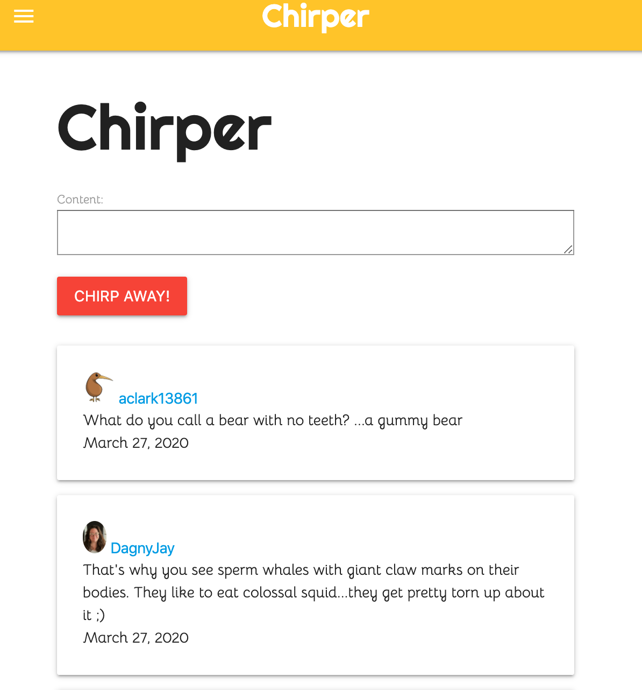
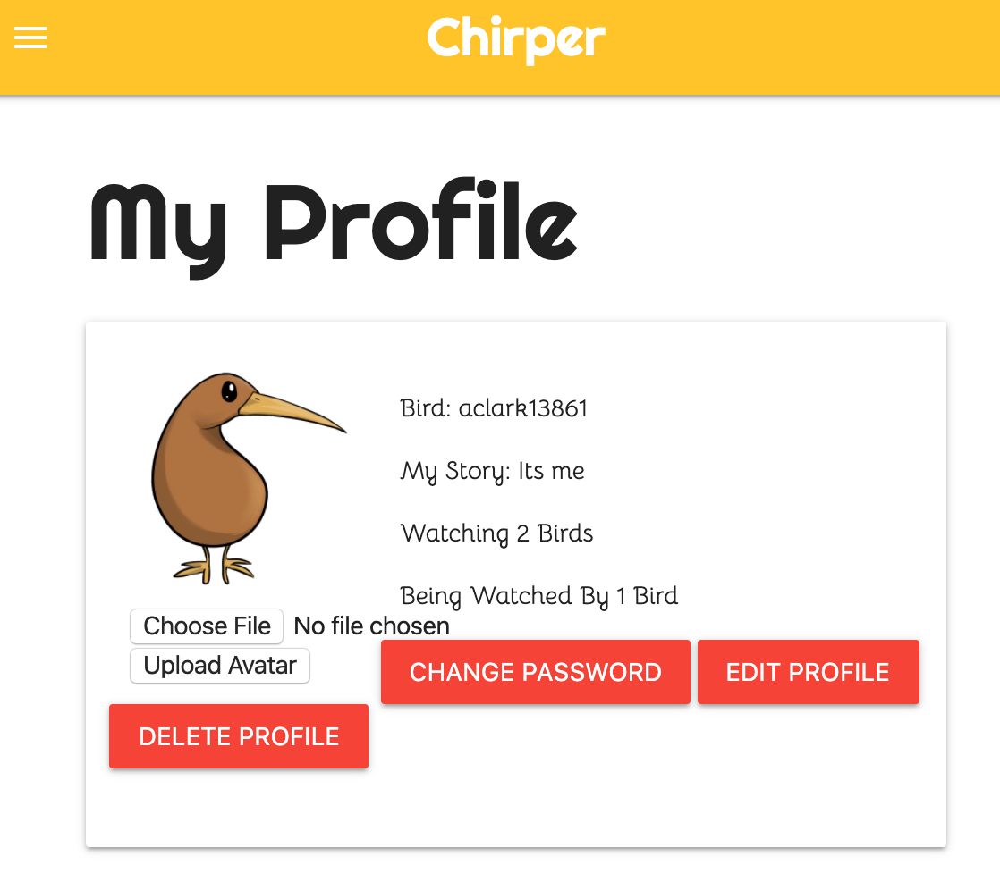
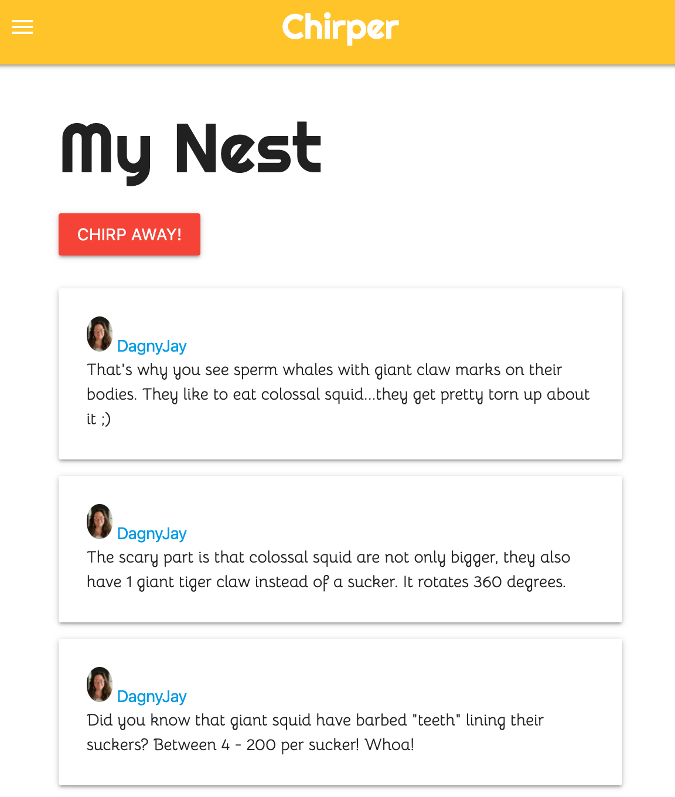

# Chirper

SEI Project 3 By Andrew Clark, Dagny Wise, Bahram Movlanov

We built Chirper to simplify your social media. Here, there's no ads, no companies, no nonsense. Just you, the people whose content you like, and 140 characters.

## Technologies used

Languages: HTML, CSS, and Python 3

Frameworks: Django
## Screenshots
#### Home page

#### My Pofile

#### My nest

## Getting Started

### Trello Board

[Trello](https://trello.com/b/6qgKzTlm/chirper)

### Try our app here

[Chirper](https://chirp-er.herokuapp.com/)

### Pitch Deck

[Pitch](https://docs.google.com/presentation/d/1ZSFpIqyOH1AXC9Zd84ja_e52ucpV_hUMQE5bWe_cp8U/edit#slide=id.g35f391192_00)

## Next Steps

* We plan to continue to improve upon chirpers styling

* The future may hold direct messaging between user's

* As a user I want to be able to add tags to the chirps

* As a user I want to be able to search for chirps by tags.

* As a user I want to be able to favorite/like the chirps
