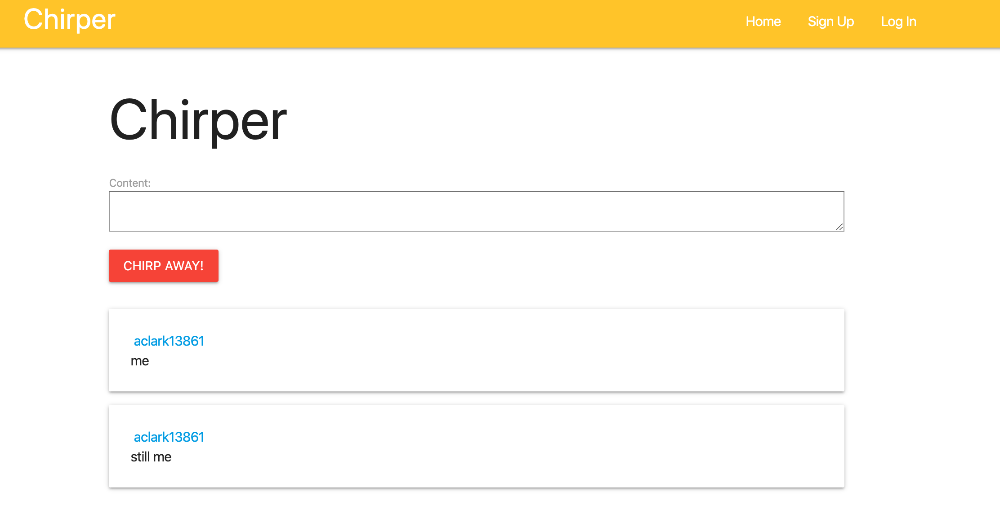
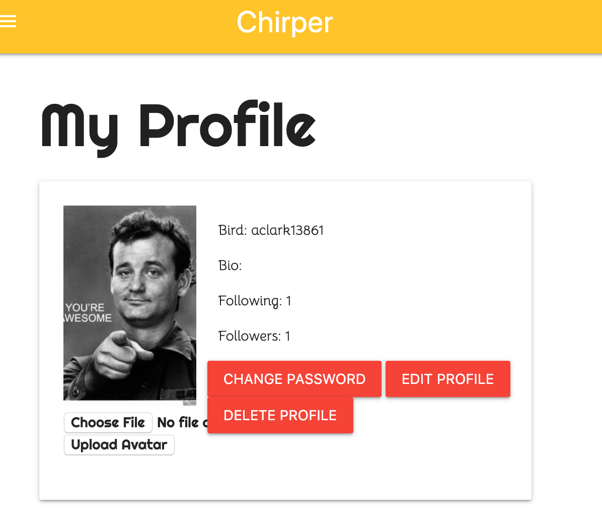

# Chirper

SEI Project 3 By Andrew Clark, Dagny Wise, Bahram Movlanov

#### Technologies used

Languages: HTML, CSS, and Python 3

Frameworks: Django

#### Home page

#### My Pofile

## Getting Started

### Trello Board

[Trello](https://trello.com/b/6qgKzTlm/chirper)

### Try our app here

[Chirper](https://chirp-er.herokuapp.com/)

### Pitch Deck

[Pitch](https://docs.google.com/presentation/d/1ZSFpIqyOH1AXC9Zd84ja_e52ucpV_hUMQE5bWe_cp8U/edit#slide=id.g35f391192_00)

## Next Steps

* As a user I want to be able to add tags to the chirps

* As a user I want to be able to search for chirps by tags.

* As a user I want to be able to favorite/like the chirps
